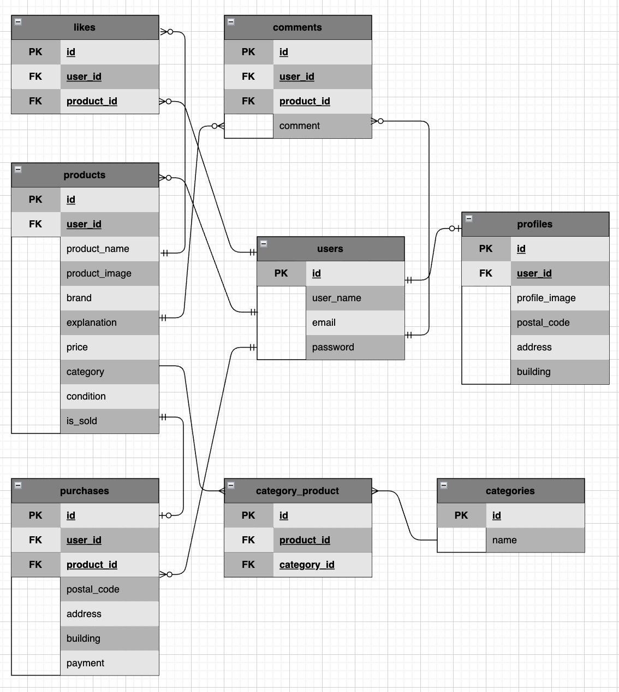

# フリーマーケットアプリ

## 環境構築
Dockerビルド
1. git clone git@github.com:m-erui307/flea-market_app.git
2. DockerDesktopアプリを立ち上げる
3. docker-compose up -d --build

Laravel環境構築
1. docker-compose exec php bash
2. composer install
3. cp .env.example .env
4. .envに以下の環境変数を追加
DB_CONNECTION=mysql
DB_HOST=mysql
DB_PORT=3306
DB_DATABASE=laravel_db
DB_USERNAME=laravel_user
DB_PASSWORD=laravel_pass
5. アプリケーションキーの作成
php artisan key:generate
6. マイグレーションの実行
php artisan migrate
7. シーディングの実行
php artisan db:seed

## 使用技術(実行環境)
- PHP8.1.34
- Laravel8.83.8
- MySQL8.0.26
- nginx1.21.1

## URL
- 開発環境：http://localhost/
- ユーザー登録：http://localhost/register
- 商品一覧（トップ画面）：http://localhost/product_list
- phpMyAdmin:：http://localhost:8080/

## ER図

## その他
会員登録、ログイン、ログアウト等を一定数繰り返し行うとHTTP 429 “TOO MANY REQUESTS”のエラーが出る。対処方法はブラウザのキャッシュクリアを行うか時間を置くと直る。